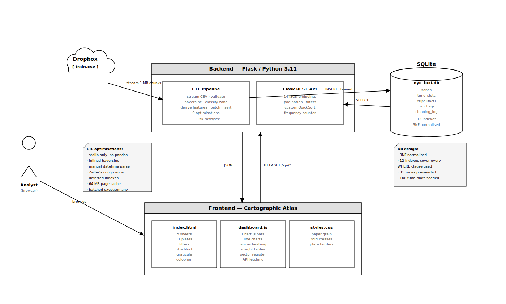
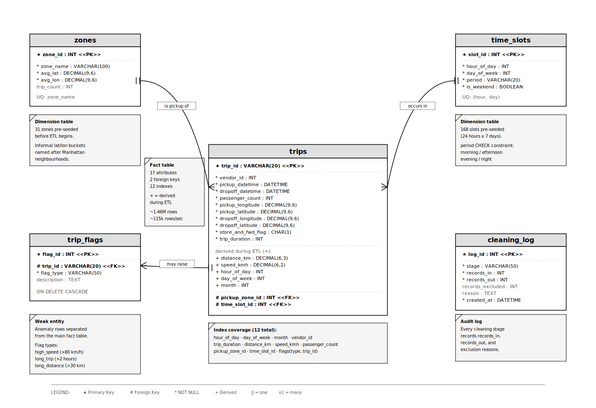

# NYC Taxi Cartographic Atlas

A full-stack urban mobility data explorer rendered as a folded paper map of New York City in pure black and white.

## Live Site
[atlas.banituze.tech](https://atlas.banituze.tech)

## Table of Contents
1. [What this is](#what-this-is)
2. [Team Members](#team-members)
3. [The five sheets](#the-five-sheets)
4. [Setup and run](#setup-and-run)
5. [Project structure](#project-structure)
6. [System architecture](#system-architecture)
7. [Database schema](#database-schema)
8. [Design concept](#design-concept)
9. [API endpoints](#api-endpoints)
10. [ETL pipeline performance](#etl-pipeline-performance)
11. [Custom DSA](#custom-dsa)
12. [Spatial aggregation](#spatial-aggregation)
13. [Team Participation Sheet](#week-participation-sheet)
14. [Video Walkthrough](#video-walkthrough)

## What this is
The **NYC Taxi Cartographic Atlas** is a full-stack web application that ingests, cleans, normalises, indexes, and visualises the NYC Taxi Trip Duration dataset published by the NYC Taxi and Limousine Commission via Kaggle. It processes approximately **1,458,644** fare records from the first half of 2016 and serves them through a Flask backend, a normalised SQLite database, fourteen REST endpoints, and a single-page browser dashboard rendered as a folded paper map of New York City.

The dashboard is organised as **five "sheets"** of a folded atlas. Every chart is a "plate" with a plate number, a marginal note, and a paper-fold drop shadow. The entire interface is rendered in **pure black and white**, every distinction made through value, typography, and ornament rather than colour.

## Team Members
| Name | Role |
|---|---|
| [**Winebald Banituze**](https://github.com/banituze) | Backend Development|
|  [**Marie Anne Orphelie Perrine**](https://github.com/OrpheliePerrine) | Frontend Development |
| [**Nadia Akua Nsiah Odame**](https://github.com/Nadia-Odame) | API Development |
| [**Chisom Louisa Obueze**](http://github.com/Chijoan) | Data Development |

## The five sheets

| Sheet | Title | Contents |
|---|---|---|
| **A** | General Survey | Survey key (4 headline figures) · Plate I *Diurnal Pulse* · Plate II *Duration Distribution* · Plate III *Velocity Distribution* |
| **B** | Temporal Charts | Plate IV *168-hour Topographic Density Map* · Plate V *Days of the Week* · Plate VI *Monthly Procession* · Plate VII *Passengers per Fare* · Plate VIII *Vendor Comparison* |
| **C** | Borough Plates | Plate IX *Pickup Density by Zone* · Plate X *Zone Register (full tabulation)* |
| **D** | Field Notebook | Plate XI *The Surveyor's Notebook*, filterable, sortable, paginated fare records |
| **E** | Marginalia | Marginal Note I *The Rush-Hour Tax* · II *The Weekend Atlas* · III *Zone Dominance* |

## Setup and run

```bash
# 1. Clone the repo and install dependencies
git clone https://github.com/banituze/nyc-atlas.git
cd nyc-atlas
pip install -r requirements.txt

# 2. Start the application
python backend/app.py

# 3. Open http://localhost:8000 in a browser
```

**No manual dataset setup is required.** On first run the application automatically downloads the Kaggle CSV from Dropbox (~20 s on fibre), runs the ETL pipeline (~30 s for 1.46 M rows), and then serves the dashboard. Subsequent runs see the populated database and skip both steps.

If you already have your own copy of `train.csv` from [Kaggle](https://www.kaggle.com/competitions/nyc-taxi-trip-duration/data?select=train.zip), place it at `data/train.csv` before the first run and the app will use it instead of downloading.

To skip auto-download entirely during development:
```bash
AUTO_PREPARE=0 python backend/app.py
```

## Project structure

```
nyc-atlas/
├── backend/
│   └── app.py                # Flask app + ETL pipeline + 14 API endpoints
├── frontend/
│   ├── index.html            # Single-page atlas with 5 sheets
│   ├── css/
│   │   └── styles.css        # Hand-written CSS (paper textures, plates, marginalia, responsive)
│   └── js/
│       └── dashboard.js      # Chart.js + canvas heatmap + filters + insights
├── database/
│   ├── schema.sql            # Tables and indexes (5 tables, 12 indexes, 3NF)
│   └── nyc_taxi.db           # Generated by ETL on first run
├── data/
│   └── train.csv             # Auto-downloaded from Dropbox on first run
├── docs/
│   └── images/               # Schema & Architecture diagrams
├── logs/
│   └── pipeline.log          # ETL audit log (generated at runtime)
└── requirements.txt
```

## System architecture



The application is a **single deployable Flask process** serving a static frontend and a JSON API. There are no microservices, no message queues, no caches, no external databases. Everything runs out of one Python process, against one local SQLite file, behind one HTTP port.

**Request lifecycle**
1. On first start, the backend checks for `data/train.csv`. If missing, it downloads the CSV from Dropbox via Python stdlib `urllib`.
2. The ETL pipeline streams the CSV, validates each row, derives features (distance, velocity, hour-of-day, day-of-week), classifies pickups into zones, and bulk-inserts into a fresh SQLite database.
3. Twelve indexes are created *after* the bulk load for maximum speed.
4. Flask then serves the frontend and answers API requests with indexed SELECT queries, typically returning in under 50 ms.
5. The browser fetches JSON from 14 endpoints and renders Chart.js plates, a canvas heatmap, filterable tables, and three narrative insight cards.

## Database schema



The schema is normalised to **Third Normal Form** with five tables:

| Table | Role |
|---|---|
| `zones` | Dimension — 16 pre-seeded lat/lon buckets
| `time_slots` | Dimension — 168 pre-seeded hour × day-of-week slots
| `trips` | Fact table — one row per cleaned trip
| `trip_flags` | Weak entity — anomalies (high speed, long trip, long distance)
| `cleaning_log` | Audit trail — one row per ETL stage

**Twelve indexes** cover every `WHERE` clause used by the API: `hour_of_day`, `day_of_week`, `month`, `vendor_id`, `trip_duration`, `distance_km`, `speed_kmh`, `passenger_count`, `pickup_zone_id`, `time_slot_id`, plus two on `trip_flags` (`trip_id` and `flag_type`).

## Design concept

The dashboard rejects the default dark-theme dashboard look in favour of a folded paper-map aesthetic rendered in **pure black and white**. Every distinction is made through value, typography, and ornament rather than colour.

- **Typography**: `DM Serif Display` for the title and sheet headings (a high-contrast serif with elegant italics), `Cormorant Garamond` for body text and plate titles (a soft book face with expressive italics), `DM Mono` for all map metadata, coordinates, and technical labels.
- **Palette**: white paper `#ffffff`, black ink `#000000`, plus four neutral grayscale values (`#1a1a1a` / `#555555` / `#999999` / `#d0d0d0`) for visual hierarchy. No colour anywhere.
- **Texture**: an SVG fractal-noise paper grain overlay gives the page a tactile printed feel. Crease shadows simulate where a real folded map would crease. An inset edge vignette gives a worn-paper feel.
- **Plates**: every chart panel is a "plate" with a plate number badge, corner brackets, a paper-fold drop shadow, and a marginal note in italic below.
- **Cartographic chrome**: graticule labels (lat/long) at the page margins · scale bar in the bottom colophon · compass rose · circular seal in the title block · plate numbers as Roman numerals in the marginalia.
- **Heatmap**: the 168-hour topographic density map is a hand-built HTML canvas (not a CSS grid), interpolating from white to black via a square-root curve.

## API endpoints

| Method | Endpoint | Description |
|---|---|---|
| GET | `/api/stats` | Headline figures: total trips, hours, mean range, mean velocity |
| GET | `/api/hourly` | 24-row hour-of-day breakdown |
| GET | `/api/daily` | 7-row day-of-week breakdown |
| GET | `/api/monthly` | 6-row monthly breakdown |
| GET | `/api/zones` | Ranked zones (uses custom QuickSort) |
| GET | `/api/duration_distribution` | Duration histogram (8 buckets) |
| GET | `/api/speed_distribution` | Velocity histogram (9 buckets) |
| GET | `/api/vendor_comparison` | Vendor I vs Vendor II on three axes |
| GET | `/api/passengers` | Passenger count distribution |
| GET | `/api/heatmap` | 168-cell hour × day matrix |
| GET | `/api/trips` | Paginated, filterable trip records |
| GET | `/api/insights` | The three pre-computed insights |
| GET | `/api/flags` | Anomaly flag counts |
| GET | `/api/cleaning_log` | ETL audit trail |

## ETL pipeline performance

The streaming ETL processes the full 1.46-million-row dataset in approximately **30 seconds** on a modest laptop (~115,000 rows per second). **Nine concrete optimisations** contribute:

1. **Single-pass streaming** with no intermediate row list (saves ~500 MB RAM vs. loading the whole CSV into memory first)
2. **`csv.reader`** instead of `csv.DictReader` (avoids 1.46 M dict allocations)
3. **Inlined haversine** with local references to math functions (~2× speedup vs. calling a function)
4. **Manual datetime parsing** (`split` + `int`) instead of `strptime` (~15× speedup)
5. **Zeller's congruence** for day-of-week, no `datetime` object construction
6. **All 31 zones pre-seeded** at schema-creation time; the foreign key is looked up inline during insert (eliminates a second pass over 1.46 M rows)
7. **Indexes created AFTER bulk load** (~5–10× insert speedup vs. maintaining indexes during insert)
8. **SQLite pragmas tuned for bulk insert**: `synchronous=OFF`, `journal_mode=MEMORY`, `temp_store=MEMORY`, 64 MB page cache
9. **Single explicit transaction** wrapping all inserts, with `executemany` batches of 100,000 rows

The full audit trail is written to `logs/pipeline.log` and recorded in the `cleaning_log` table.

## Custom DSA

Two custom data structures and algorithms were implemented from scratch as required by the assignment:

### QuickSort with median-of-three pivot
In-place sort that picks the median of `arr[lo]`, `arr[mid]`, `arr[hi]` as the pivot before partitioning. Average time complexity **O(n log n)**; worst case **O(n²)** only on adversarial inputs that median-of-three makes vanishingly unlikely. Space complexity **O(log n)** for the recursion stack. See `quicksort()` in `backend/app.py`.

### Frequency counter
Dict-backed accumulator with single-pass construction, then delegates to our own `quicksort` to return items sorted by count descending. **O(n)** time for counting, **O(k log k)** for sorting the distinct keys. No `collections.Counter`. See `frequency_count()` in `backend/app.py`.

Both are exposed through the `/api/zones` endpoint.

## Spatial aggregation

Each trip's pickup coordinates are grouped into one of **thirty-one zones via a piecewise envelope** by a constant-time classifier in `backend/app.py` (see `classify_zone()`). The classifier narrows by latitude band first, then branches on longitude.

**Important disclaimer:** the bucket names (Midtown South, Upper East Side, etc.) are **informal labels** based on where those neighbourhoods appear on a public map of Manhattan, they are **descriptive shortcuts for aggregation, not surveyed boundaries**. A production version would swap this for a point-in-polygon lookup against the NYC TLC's official taxi zone shapefile.

Running the classifier over the full 1,439,425 cleaned records produces this ranked register (rendered as **Plate X** in the application):

| #  | Zone                                 | Trips   | Share     | Duration  | Velocity   |
|----|--------------------------------------|---------|-----------|-----------|------------|
| 01 | Midtown West / Times Square          | 163,319 | 11.3461%  | 13.33 min | 13.69 km/h |
| 02 | East Village / NoHo                  | 155,797 | 10.8236%  | 12.74 min | 12.96 km/h |
| 03 | Midtown East / Grand Central         | 134,628 | 9.3529%   | 13.33 min | 12.74 km/h |
| 04 | Upper East Side South                | 127,564 | 8.8621%   | 11.51 min | 14.30 km/h |
| 05 | Midtown South / Flatiron             | 107,438 | 7.4640%   | 13.32 min | 12.70 km/h |
| 06 | Upper East Side                      | 107,173 | 7.4455%   | 11.75 min | 14.81 km/h |
| 07 | Gramercy / Murray Hill               | 92,995  | 6.4606%   | 12.85 min | 13.43 km/h |
| 08 | Upper West Side                      | 85,433  | 5.9352%   | 11.65 min | 15.08 km/h |
| 09 | West Village / Meatpacking           | 83,819  | 5.8231%   | 13.26 min | 13.98 km/h |
| 10 | Stuyvesant / LES North               | 69,489  | 4.8276%   | 12.24 min | 14.10 km/h |
| 11 | Lower East Side / Chinatown          | 56,128  | 3.8993%   | 13.86 min | 14.35 km/h |
| 12 | Lower Manhattan / Financial District | 48,084  | 3.3405%   | 17.30 min | 15.71 km/h |
| 13 | East Queens                          | 36,422  | 2.5303%   | 30.07 min | 21.63 km/h |
| 14 | Tribeca / SoHo                       | 33,875  | 2.3534%   | 14.70 min | 14.31 km/h |
| 15 | South Queens                         | 30,911  | 2.1475%   | 41.69 min | 28.11 km/h |
| 16 | West Queens                          | 25,384  | 1.7635%   | 13.56 min | 15.98 km/h |
| 17 | Chelsea / Hudson Yards               | 21,619  | 1.5019%   | 12.66 min | 13.77 km/h |
| 18 | West Brooklyn                        | 16,174  | 1.1236%   | 14.81 min | 16.64 km/h |
| 19 | Morningside Heights                  | 12,181  | 0.8462%   | 12.84 min | 16.33 km/h |
| 20 | North Brooklyn                       | 8,029   | 0.5578%   | 13.27 min | 16.03 km/h |
| 21 | Outer Boroughs                       | 7,594   | 0.5276%   | 13.57 min | 14.69 km/h |
| 22 | East Harlem                          | 7,372   | 0.5121%   | 11.54 min | 16.16 km/h |
| 23 | Harlem                               | 3,369   | 0.2341%   | 13.41 min | 18.70 km/h |
| 24 | Central Brooklyn                     | 2,187   | 0.1519%   | 14.39 min | 17.40 km/h |
| 25 | Washington Heights                   | 1,114   | 0.0774%   | 14.85 min | 21.15 km/h |
| 26 | South Bronx                          | 507     | 0.0352%   | 14.71 min | 17.65 km/h |
| 27 | Central Bronx                        | 287     | 0.0199%   | 14.13 min | 18.78 km/h |
| 28 | South Brooklyn                       | 273     | 0.0190%   | 14.96 min | 20.72 km/h |
| 29 | East Bronx                           | 136     | 0.0094%   | 14.69 min | 20.80 km/h |
| 30 | Inwood                               | 118     | 0.0082%   | 14.21 min | 18.27 km/h |
| 31 | Staten Island                        | 6       | 0.0004%   | 24.22 min | 48.75 km/h |

Live trip counts and shares come from the `/api/zones` endpoint after the ETL pipeline runs against the full 1,458,644-row dataset. The Borough Plates sheet (Plate IX and Plate X) renders the ranked register dynamically from that endpoint, so the actual numbers reflect the real distribution at the moment you load the page.

**Why the distribution is so skewed:** Around 99.8% of cleaned pickups in this dataset originate in Manhattan, which is why Manhattan gets 19 sub-zones while the four outer boroughs collapse into 11 broader zones. Resolution follows density: every Midtown sub-zone alone generates more pickups than the entire Bronx. For an urban mobility planner this is the most important finding in the dataset, supply must follow density, the outer boroughs are systemically under-served by yellow cabs, and pricing experiments should be A/B tested in the dense Manhattan zones first where statistical power is highest.

## Team Participation Sheet
[Team Participation Sheet](https://docs.google.com/spreadsheets/d/17tRKJmeQCvmZCTP5q8At6_ws-PNvF0bqPHusnQGhhAQ/edit)

## Video Walkthrough
[Video Walkthrough](https://drive.google.com/file/d/1Uulq5lrRVKFNc2aIErOCkUoWk1VYYqBj/view)
